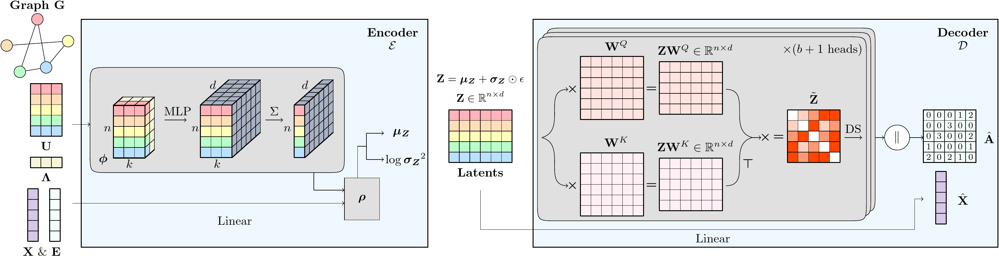
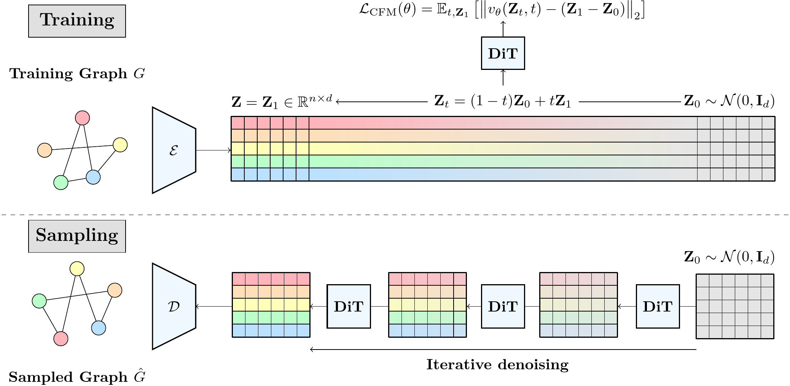

# Principled Latent Diffusion for Graphs via Laplacian Autoencoders

Pytorch implementation for LG-VAE and the associated latent graph diffusion model.

> We introduce the LG-VAE, a principled graph autoencoder, with strong recontruction accuracy. 🎯



> We train a flow-matching model in the latent space of our autoencoder. Thanks to the fixed size of the node embeddings and the efficiency of the DiT, our approach yields substantial inference speed-up 🚀



## 🧱 Environment Installation

We use **Conda** to manage the environment. All dependencies are specified in the provided configuration file [`environment.yml`](./environment.yml).

### 🔧 Step 1: Create the Conda Environment

Run the following command from the root directory of the repository:

```bash
conda env create -f environment.yml
conda activate lgflow
```
### 🔧 Step 2: Compile orca 

The evaluation on synthetic graphs requires to compile orca. Navigate to the ./src/analysis/orca directory and compile orca.cpp:

```bash
cd ./src/analysis/orca
g++ -O2 -std=c++11 -o orca orca.cpp
```

## 🚀 Run the code

Latent diffusion models are trained using a two stages framework :

1. Train the autoencoder using : ```python main_ae_kl.py --config-name=<config_name> checkpoint="path_to_ae_ckpt_location"```.
   where ```<config_name>``` is the config file, located in the configs folder under the name ```<dataset>_ae_train.yaml```, ```path_to_ae_ckpt_location``` is a user-specified path to the location where the autoencoder checkpoint is saved.
2. (Optional) Evaluate your autoencoder for reconstruction : ```python eval_ae.py --config-name=<config_name> checkpoint="path_to_ae_ckpt_location"```
3. Train the latent diffusion model :
   - On synthetic graphs : ```python main_synthetic.py --config-name=<config_name> ae_checkpoint_file="path_to_ae_ckpt_location" checkpoint="path_to_fm_ckpt_location"```
   - On molecular graphs : ```python main.py --config-name=<config_name> ae_checkpoint_file="path_to_ae_ckpt_location" checkpoint="path_to_fm_ckpt_location"```
   - On DAGs : ```python main_dag.py --config-name=<config_name> ae_checkpoint_file="path_to_ae_ckpt_location" checkpoint="path_to_fm_ckpt_location"```
where ```<config_name>``` is your config file, located in the configs folder under the name ```<dataset>_fm_train.yaml```
4. Sample the latent diffusion model :
   - On synthetic graphs : ```python eval_fm_synthetic.py --config-name=<config_name> ae_checkpoint_file="path_to_ae_ckpt_location" checkpoint="path_to_fm_ckpt_location"```
   - On molecular graphs : ```python eval_fm.py --config-name=<config_name> ae_checkpoint_file="path_to_ae_ckpt_location" checkpoint="path_to_fm_ckpt_location"```
   - On DAGs : ```python eval_fm_dafg=.py --config-name=<config_name> ae_checkpoint_file="path_to_ae_ckpt_location" checkpoint="path_to_fm_ckpt_location"```
where ```<config_name>``` is your config file, located in the configs folder under the name ```<dataset>_fm_train.yaml```
