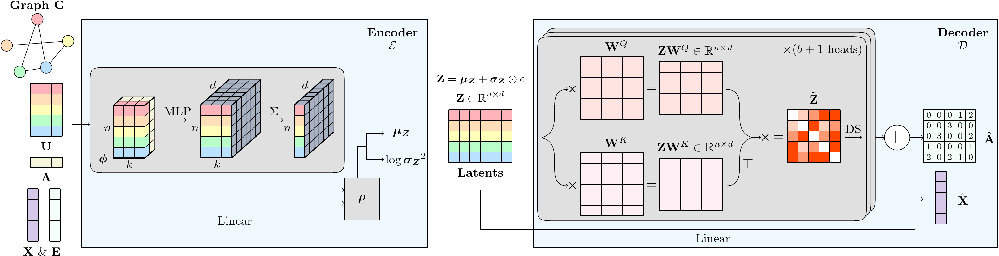
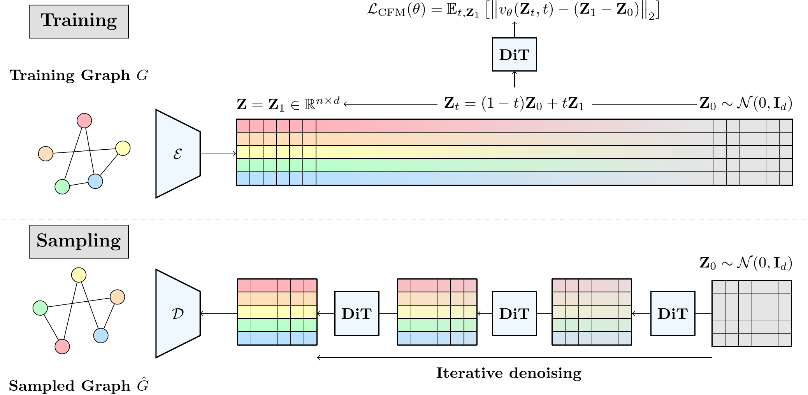

# Principled Latent Diffusion for Graphs via Laplacian Autoencoders

Pytorch implementation for LG-VAE and the associated latent graph diffusion model.

> We introduce the LG-VAE, a principled graph autoencoder, with provable recontruction accuracy. 🎯


> We train a flow-matching model in the latent space of our autoencoder. Thanks to the fixed size of the node embeddings and the efficiency of the DiT, our approach yields substantial inference speed-up 🚀



## 🧱 Environment Installation

We use **Conda** to manage the environment. All dependencies are specified in the provided configuration file [`environment.yml`](./environment.yml).

### 🔧 Step 1: Create the Conda Environment

Run the following command from the root directory of the repository:

```bash
conda env create -f environment.yml
conda activate lgdm
```
### 🔧 Step 2: Compile orca 

The evaluation on synthetic graphs requires to compile orca. Navigate to `./evaluation/synthetic/orca` and compile `orca.cpp`:

```bash
cd ./evaluation/synthetic/orca
g++ -O2 -std=c++11 -o orca orca.cpp
```

## 🚀 Run the code

Latent diffusion models are trained using a two stages framework :

1. Train the autoencoder using : ```python main_ae.py --config-name=<config_name> checkpoint="path_to_ae_ckpt_location"```.
   where ```<config_name>``` is the config file, located in the configs folder under the name ```<dataset>_ae_train.yaml```, ```path_to_ae_ckpt_location``` is a user-specified path to the location where the autoencoder checkpoint is saved.
2. (Optional) Evaluate your autoencoder for reconstruction : ```python eval_ae.py --config-name=<config_name> checkpoint="path_to_ae_ckpt_location"```
3. Train the latent diffusion model : ```python main_fm.py --config-name=<config_name> ae_checkpoint_file="path_to_ae_ckpt_location" checkpoint="path_to_fm_ckpt_location"```
where ```<config_name>``` is your config file, located in the configs folder under the name ```<dataset>_fm_train.yaml```

4. Sample the latent diffusion model : ```python eval_fm.py --config-name=<config_name> ae_checkpoint_file="path_to_ae_ckpt_location" checkpoint="path_to_fm_ckpt_location"```
where ```<config_name>``` is your config file, located in the configs folder under the name ```<dataset>_fm_test.yaml```

## ➕ Add a new dataset

To add a new dataset to LG-Flow, follow the same pattern as the existing files in [`datasets/`](./datasets), [`configs/dataset/`](./configs/dataset), and [`utils.py`](./utils.py):

1. Add a dataset wrapper in [`datasets/`](./datasets) and export it from [`datasets/__init__.py`](./datasets/__init__.py).
2. Register it in the `DATASETS` mapping in [`utils.py`](./utils.py).
3. Add `configs/dataset/<dataset_name>.yaml` with the dataset metadata used by training.
4. Add the task configs in [`configs/`](./configs), usually `<dataset_name>_ae_train.yaml`, `<dataset_name>_fm_train.yaml`, and `<dataset_name>_fm_test.yaml`.
5. If the dataset needs custom evaluation, update the sampling metrics in [`fm/fm_helpers.py`](./fm/fm_helpers.py) and the corresponding module under [`evaluation/`](./evaluation).

As a rule of thumb, start from the closest existing dataset in the repo:
- planar/tree/ego/protein are good templates for undirected graph datasets
- `er_dag` and `price` are the templates for directed datasets
- `moses` and `guacamol` are the templates for molecular datasets
